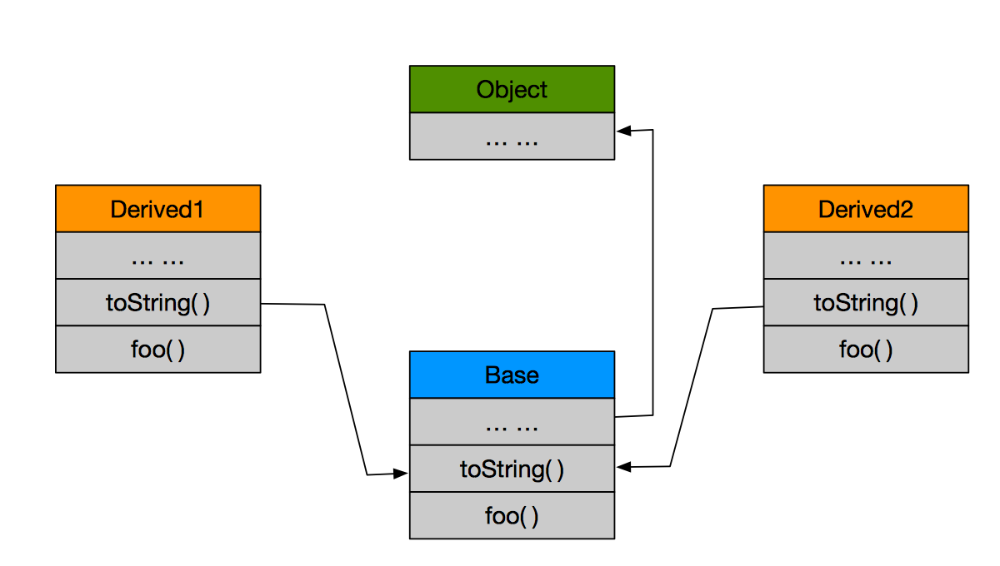
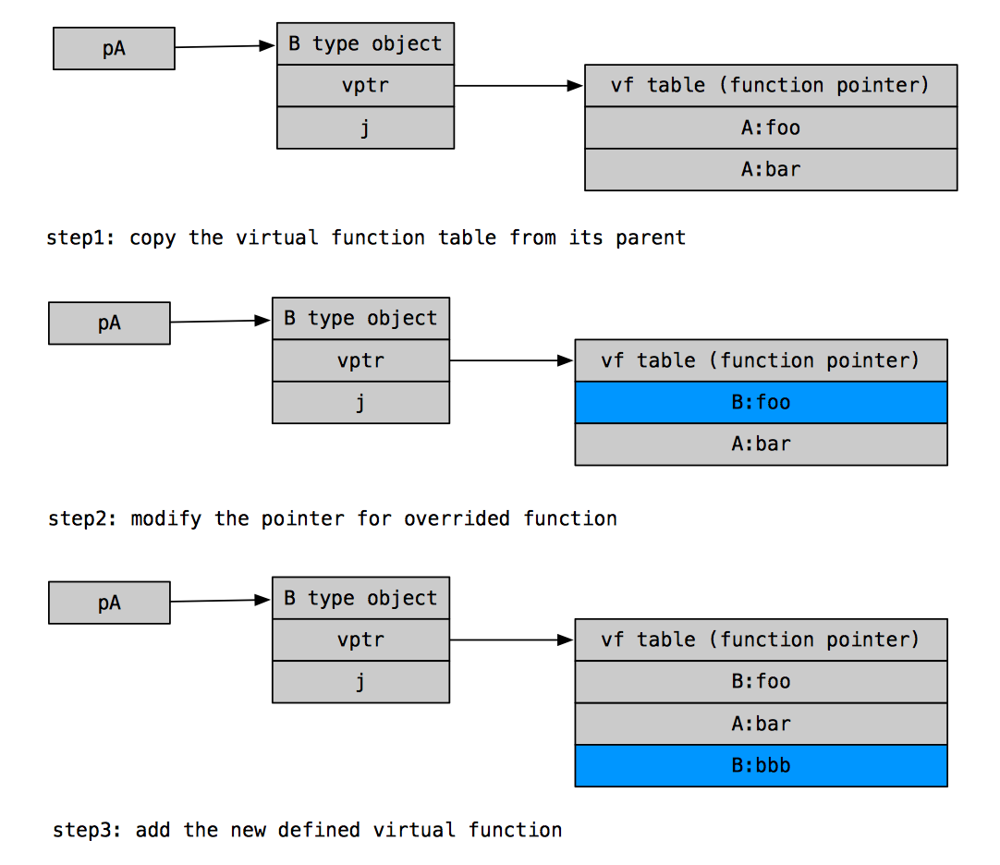
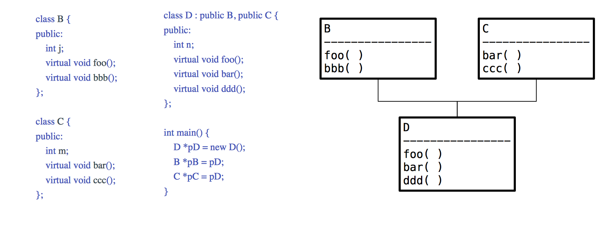
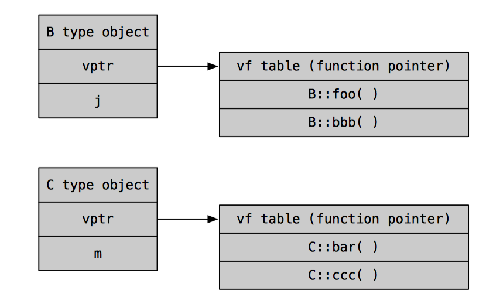
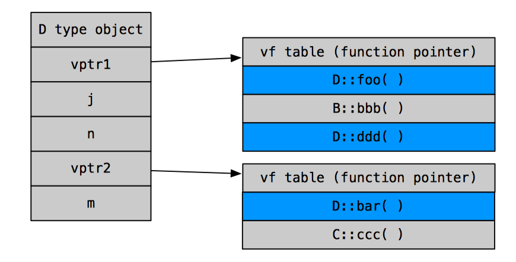
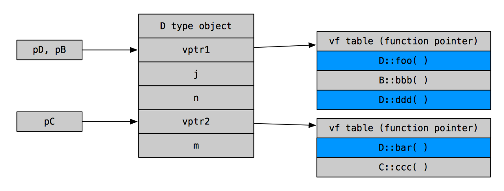
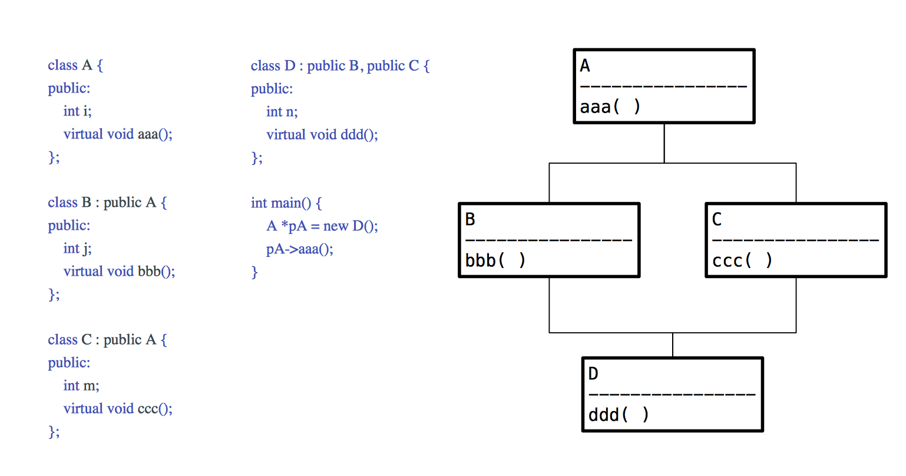
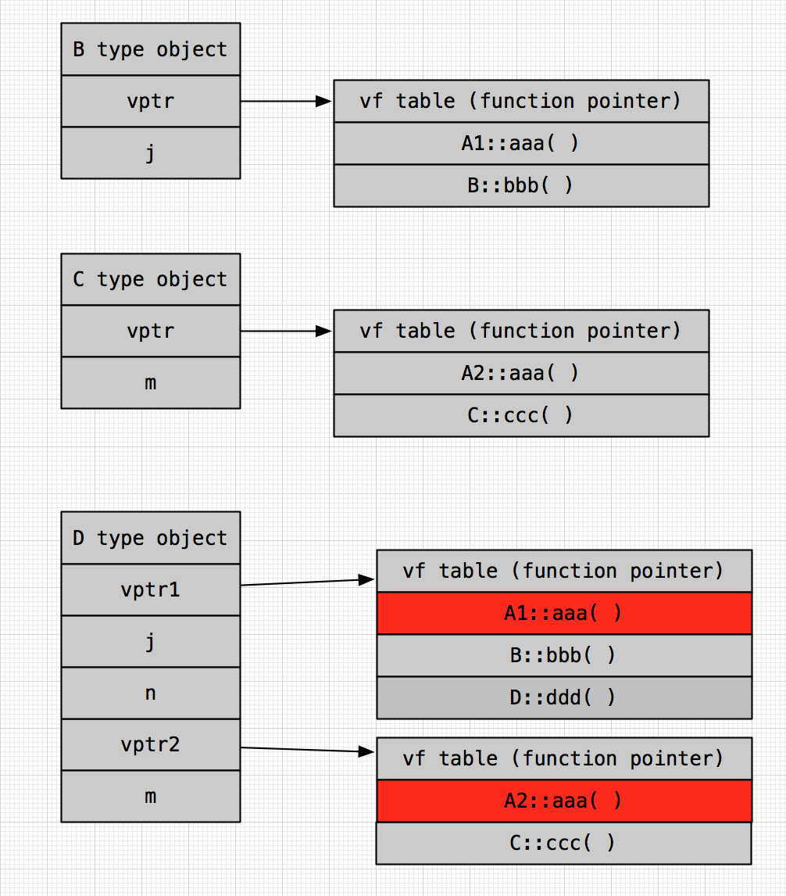
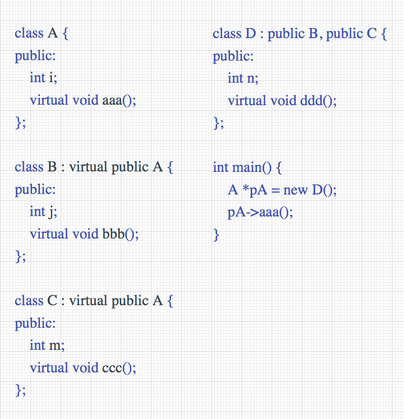
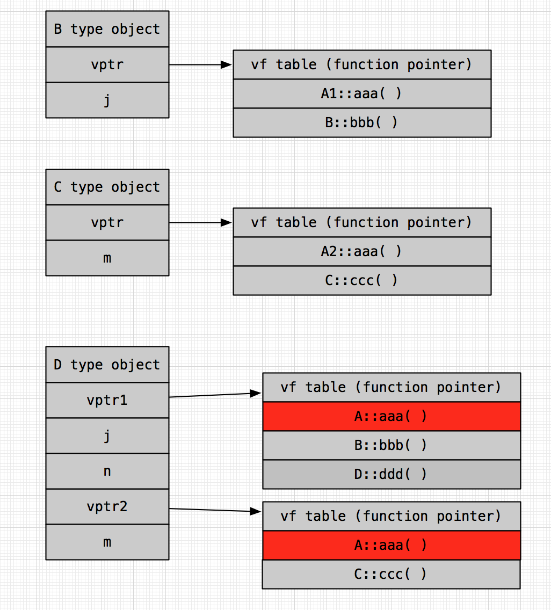

## 引言

在面向对象编程 (OOP) 领域，有三个很重要的概念：封装 (encapsulation)、继承 (inheritance)、多态 (polymorphism)。
本文主要在编程语言层面探讨多态如何实现，由于笔者比较熟悉的语言只有两种，所以主要探讨多态在 C++ 和 Java 上的实现。
C++有四种编程范式，本文主要关注其面向对象的编程范式。Java被认为是“最规范的”的面向对象语言，希望可以通过两者的对比，给
读者一些启示。

由于，两种语言在设计理念上的不同，可能会导致叙述时无法使用某个语言特有的术语。所以，本文所有的术语基于面向对象编程的层面，
而不是某种语言的层面。例如，“引用” 和 “指针” 不加以区别，“方法” 和 “函数” 不加以区别， “多继承” 和 “多接口” 不加以区别。

## 静态分派 vs. 动态分派

相信有面向对象编程经验的朋友都应该对这两概念不陌生，这两种分派机制，正是多态的体现。最直观的感受是，“方法重载”
(method overload) 是静态分派的一种，“方法重写(覆盖)” (method override) 则是动态分派的一种。静态分派的最直接的解释
是在重载的时候是通过参数的静态类型而不是实际类型作为判断依据的。而动派分派则不然，它最直接的解释是子类可以覆盖超类中的方法，
通过超类的引用可以调用子类的方法。下面是 Java 版的重载和重写例子：

```java
// overload example
class OverloadExample {
    public int foo(int k) {
        return k;
    }
    public int foo(int i, int j) {
        return i + j;
    }
}

// override example
class OverrideExampleBase {
    public int foo(int i, int j) {
        return i + j;
    }
}

class OverrideExampleDerived extends OverrideExampleBase {
    public int foo(int i, int j) { 
        return i * j;
    }
}

// possible consumer code
class Driver {
    public static void main() {
        OverloadExample e1 = new OverloadExample();
        e1.foo(10);     // result 10
        e1.foo(10, 20); // result 30

        OverrideExampleBase e2 = new OverrideExampleBase();
        OverrideExampleBase e3 = new OverrideExampleDerived();
        e2.foo(10, 20); // result 30
        e3.foo(10, 20); // result 200
    }
}
```

体会上面的代码，这两者的区别是，静态分派的代码，方法调用在编译期间已经可以确定了。而动态分派代码的方法调用则需要
在运行时才可以确定。

## 继承 + 多态

稍微了解两种分派机制后我们可以看到，静态分派在实现上比较简单，主要是检查参数列表，选择相匹配的就好了。本文主要讨论
的是动态分派机制在语言层面的实现。而一般来说，动态分派都需要和继承有关系，如果没有继承关系，那么动派分派也就没有什
么意义。C++ 和 Java 两种语言，其中 C++ 没有定义专门的 `interface` 和 `abstract` 等关键词，并且在语法上支持
“多继承”。Java 定义了这些关键字，不过一个类不能同时继承自两个超类，但是一个类可以实现多个接口。下文，将视实现“多
接口”和“多继承”为同一回事 (战略上相同，战术上不同)。

### 单继承

在单继承的情况下，两种语言的实现在宏观上基本一致，都是通过计算被调用函数在函数表中的偏移量 (offset) 来进行函数调
用的。

#### Java 单继承

开始之前先回顾一下一些基础知识，首先是 JVM 的运行时数据区 (runtime data area)，见下图，每个区域的作用如下所述：

- 运行常量池 (runtime constant pool): 线程共享，存放程序需要的各种常量
- 方法区 (method area): 线程共享，存放的是类型信息，是对象创建的模板
- 堆内存 (heap): 线程共享，存放运行时产生的对象
- 虚拟机栈 (vm stack): 线程独有，描述 Java 方法执行的内存模型
- 本地方法栈 (native method stack): 线程独有，和虚拟机栈类似，但是这里是为虚拟机使用到的 Native 方法服务
- 程序计数寄存器 (program counter register): 线程独有，指向当前线程所执行的字节码的行号


其次，类是怎么被加载进入虚拟机的。根据 “Java 虚拟机规范”，类的加载可以分为一下几个步骤：


在本文讨论的范围内，我们需要知道的是 ”解析阶段 (resolution)”，这个阶段主要干的事情就是把符号引用 (symbolic reference)
解析称为直接引用 (direct reference)，即某个标识符在内存中的地址。

> 符号引用与虚拟机实现的布局无关，引用的目标并不一定要已经加载到内存中。各种虚拟机实现的内存布局可以各不相同，但是它们能接受的
> 符号引用必须是一致的，因为符号引用的字面量形式明确定义在Java虚拟机规范的Class文件格式中。
> 
> 直接引用可以是指向目标的指针，相对偏移量或是一个能间接定位到目标的句柄。如果有了直接引用，那引用的目标必定已经在内存中存在。

有了上面的知识，考虑如下程序：

```java
class Base {
    public String toString() {
        return "override toString in Base";
    }
    public void foo() {
        System.out.println("foo method in Base");
    }
}

class Derived1 extends Base {
    public void foo() {
        System.out.println("foo method in Derived1");
    }
}

class Derived2 extends Base {
    public void foo() {
        System.out.println("foo method in Derived2");
    }
}

// possible consumer code
class Driver {
    public static void main() {
        Base ref  = new Base();
        Base ref1 = new Derived1();
        Base ref2 = new Derived2();

        ref.equals(ref1);   // false, equals() method inherits from Object
        ref1.toString();    // "override toString in Base"
        ref2.toString();    // "override toString in Base"
        ref1.foo();         // "foo method in Derived1"
        ref2.foo();         // "foo method in Derived2"
    }
}
```

如果上述 `Driver` 类的 `main` 方法被执行，相应的对象在内存中的模型应该如下图所示 (**对象模型内的方法表，永远会
将超类的方法按照原顺序复制，然后再接着类新定义的方法**)。考虑`ref2.toString()`这一行代码是怎么执行的，JVM 执行
引擎是怎么定位到这个方法并且执行它的。这里很容易就会想当然，一种 **错误** 的想法是：JVM 根据堆上的对象实例，查
找其方法表，找到 `toString` 方法，然后执行其字节码。这里的问题是 `ref2` 前面声明的类型是 `Base` 而不是其对
象的类型 `Derived2`，而在编译期间，编译器没有办法知道这个引用变量后面会指向一个子类的对象，所以在编译期间没法确
定调用的方法。这也正是本文探讨的关键点，什么机制可以让虚拟机在运行时，正确的找到需要调用的方法。



Java 中通过超类指针访问子类方法的操作，由字节码指令`invokevirtual`定义，JVM 采取的解决方案是这个样子的：

1. 通过超类的运行时常量池，确定目标方法的符号引用；
2. 解析符号引用，得到目标方法的直接引用 (方法入口的地址)
3. 计算该地址在超类方法表中的偏移量
4. 通过上述的偏移量，调用引用变量指向的实际对象的这个偏移量指向的方法

#### C++ 单继承

C++ 的实现原理上基本一致，但是由于 C++ 的运行环境没有 Java 那么强大，所以更多的工作要依靠编译器来完成。

同样用一个例子来解释一下，考虑如下代码：

```c++
class A {
    int i;
    virtual void foo();
    virtual void bar();
};

class B : public A {
    int j;
    virtual void foo();
    virtual void bbb();
};

int main() {
    A *pA = new B();
    pA->foo();
    return 0;
}
```

当代码在编译时，编译器会为每一个类创建一个虚函数表，当一个类的对象被创建出来时，每个对象都有自己的虚函数表。
故名思议，只有被定义为虚函数的函数，才会在这个表里。对象被实例化的不同过程中，这个表一直被维护，使其能够正确
的指向正确的函数。当上述的 `main` 代码被执行时，`pA` 指针指向的对象的虚函数表变化如下图所示。



如此，当使用 `pA` 指针指向子类对象时，因为虚函数表的存在，多态得意顺利的体现。

### 多继承(实现)

Java 的多实现和单继承的前面两步基本一致，但是不能通过偏移量来确定子类中的目标函数的地址了。因为在多现实的情况下，不能
确保偏移量是一致的。Java 解决这个问题的方案非常的暴力，那就是搜索整个方法表，找到签名一致的方法，然后调用之。

所以，我们可以得到一个结论，在 Java 中，调用 `implement` 实现的接口会比调用 `extends` 继承的方法需要的时间长，因为
前者需要搜索这个方法表，后者可以直接通过偏移量定位。

C++，很遗憾，也是因为没有 Java 这个强大的运行时环境，所以实现会比较复杂。这里先暂时不考虑多继承中的“钻石问题”。考虑如下
代码：



这里，类 `D` 同时是 类 `B` 和 类 `C` 的子类，并且分别覆盖了两个超类其中的一个函数，添加了一个虚函数。毫无疑问，根据单继承
时的知识，我们可以知道类 `B` 和 类 `C` 的对象的内存模型应该如下图所示：



有了这里两个超类的对象模型，我们自然想知道类 `D` 的对象的模型应该是怎么样的。单继承的时候，有一个虚函数表，那么多继承也很好
办，**有多少个超类就有多少个虚函数表**就好了。所以，这里意味着类 `D` 的对象应该有两个虚函数表指针。我们应该知道，在 C++ 里
一个对象的指针应该指向这个对象在内存中的首地址 (比如，数组的名字就是指向数组第一个元素的指针)。出于这点考虑，类 `D` 定义的变量
和函数，应该和第一个声明的超类虚函数和可继承变量放在一起，这样才可以实现函数覆盖。



上述代码中的的三个指针分别指向的位置，如下图所示：



这里的指针位置，马上就带出了一个很严重的问题。如果在某种情况下，我想通过指针释放动态分配的内存，执行了下面的代码：

```c++
delete pC;
```

很显然，`pC` 指针并没有指向对象的首地址，这样的 `delete` 语句只能释放到一部分的对象内存，从而造成内存泄漏问题 (memory leak)。
但是在这个问题之前，`pC` 是怎么指向上图所示的地方的，通过代码可以看到它指向的是一个 `D` 类对象，很显然这个位置是合理的。但是编译器
是怎么做到的？实现这个很简单，通过一个临时指针变量就可以做到。编译器隐性地执行了如下的代码：

```c++
D *tmp = new D();
C *pC = tmp? tmp + sizeof(B) : 0;
```

这种操作，我们称为“指针调整”，上述的方法能够解决 `pC` 的创建问题，但是还是没有解决释放内存的问题。通常来说，目前解决的方案大致有两种，
一种是为虚函数表的每一个条目增加一个偏移量信息，标注从对象首地址到函数地址的偏移量。但是这种做法，对效率有比较大的影响，基本上不管那个
虚表是否需要做指针调整，我们都要维护这个偏移量信息，因为在编译期间并不知道到底那些需要进行指针调整。

另一种操作，被称为“thunk”技术。这种技术的作用是：虚函数表中的条目仍然继续放一个虚函数实体地址，但是如果调用这个虚函数需要进行调整的
话，该条目中的地址就指向一个thunk而不是一个虚函数实体的地址。这个方法的实现是为每个虚表条目都增加一小段汇编代码，如果需要调整，汇编
代码会把指针调整到相应的位置，如果不需要，则不动。这个方法，没有实际上增加虚函数表的内存消耗，而是相当于添加多了一个抽象层。听起来比
第一种方法好，但是显然，实现的难度更大一些。

### 虚拟继承

最后，来看一下著名的多继承里面的“钻石问题”及其解决方案“虚拟继承”。假设，有如下图所示的类结构以及代码 (这是一会导致“钻石问题”错误的例子)：



重点关注一下 `main` 方法，试图通过 “爷爷类” 的指针 `pA` 指向其 “孙子” 类的对象实例，然后调用 “爷爷类” 的方法。这里的问题在于，当 `D`
类对象在初始化时，需要先初始化其父类对象 (即 `B` 类和 `C` 类)，同理，初始化这两个类的时候，需要线初始化 `A` 类对象。但是由于这里并没有
制定虚拟继承。所以，`B` 类在初始化的时候初始化了一个 `A` 类对象 (给个名字叫做 “objA1”)，`C` 类在初始化的时候也初始化了一个 `A` 类对
象 (给个名字叫做 “objA2”)，这就有了**两个** `A` 类对象，当我们在 `main` 里面执行 `pA->aaa()` 的时候，出现了歧义，不知道应该执行
哪一个 `A` 类对象 (objA1 or objA2) 的方法。这个就称为“钻石问题”。

这时，对象 `D` 的内存布局如下图所示，红色标注的就是冲突的两个方法 (A1为A类型的一个对象，A2为A类型的另一个对象) ：



解决方法，当然就是声明虚继承了。虚拟继承之后，初始化 `B` 和 `C` 的时候不会创建两个 `A` 的对象，而是只会创建一个，然后这两个子类共享
一个超类。如下图所示，不存在 A1 和 A2 只有一个 A：



